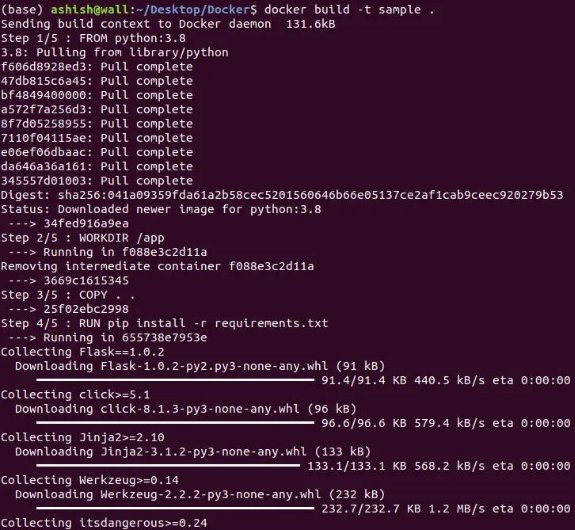
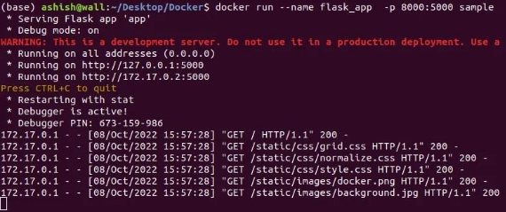
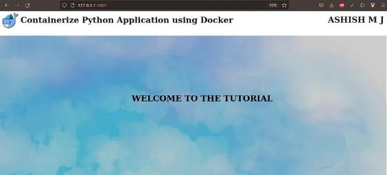
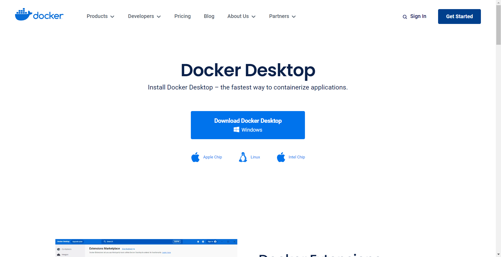
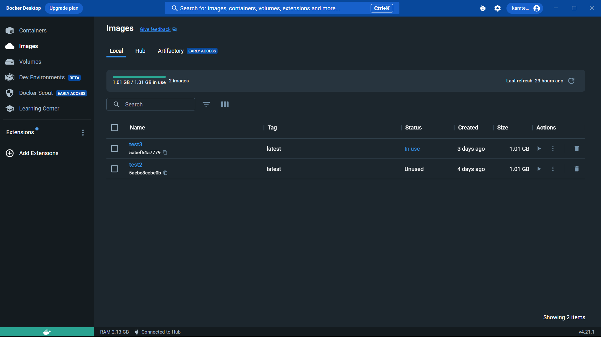
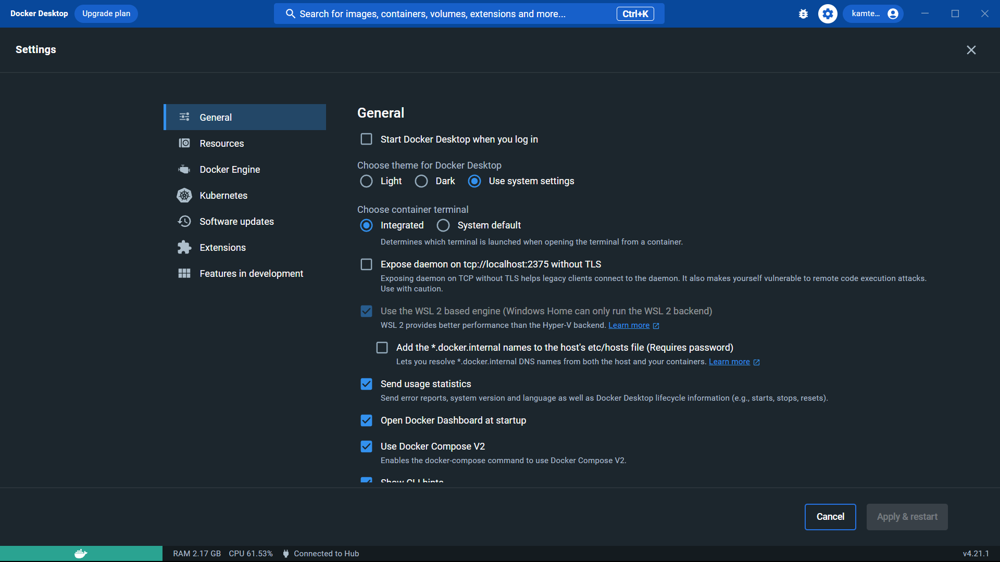
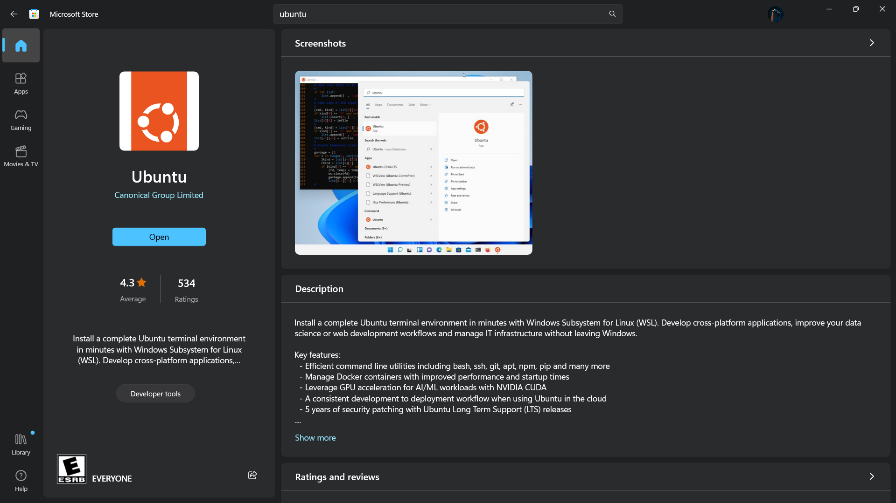
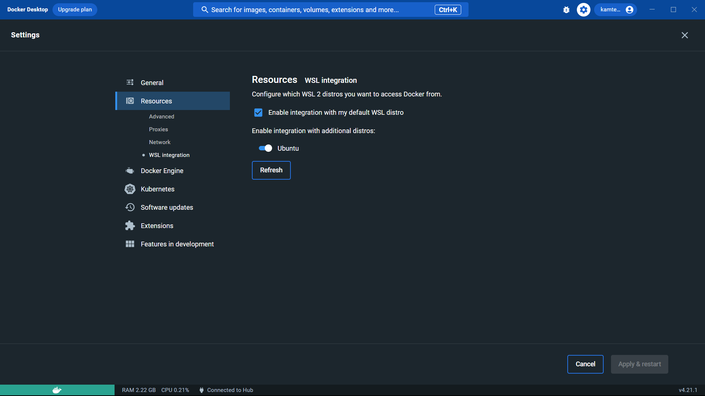

# **CONTAINERIZATION AND AUTOMATION**

Here we will be going to cover the whole process from containerization to automation of an application.

It involves several steps:-

1. Containerize the application
1. Platforms for Deployment of Image
1. Choosing a Suitable Platform
1. Deploy and Run on Container Service
1. Creating a CI/CD Pipeline

Our flow in this documentation will be as follows:-


<br>
<br>


## **Containerize a Python Application using Docker**

### **What is Docker?**

It is a platform for developing, shipping and running applications. In simple terms, you can build your application, package them along with their dependencies into a container, and then these containers can be shipped to run on other machines.


### **KeyTerminologies**

- **Dockerfile** : A text file that consists of instructions and arguments. It informs Docker how the image should get built.
- **Image** : It is a read-only template with instructions for creating a container. Each instruction in a Dockerfile creates a layer in the image.
- **Container** : It is a running instance of an image. It is well defined by its image as well as any configuration options provided to it create or start.


Multiple running instances (container) of the same image (template)

### **Dockerfile Instruction**

A Dockerfile consists of a set of instructions and arguments. The general syntax is ***INSTRUCTION arguments***

The most commonly used Dockerfile instructions are :


```dockerfile
# This is a sample Dockerfile

# set base image python:3.8-slim-buster
FROM python:3.8-slim-buster

# set working directory as app
WORKDIR /app

# copy requirements.txt file from local (source) to file structure of container (destination) 
COPY requirements.txt requirements.txt

# Install the requirements specified in file using RUN
RUN pip3 install -r requirements.txt

# copy all items in current local directory (source) to current container directory (destination)
COPY . .

# command to run when image is executed inside a container
CMD [ "python3", "app.py" ]
```

### **Docker Commands**

The most commonly used docker commands are :


### **Getting Started**

We will create a simple project to containerize a Python application by following the steps mentioned below :

- Create a simple static web application using flask
- Create a Dockerfile
- Build image out of Dockerfile
- Run the image in the container

  Project structure:

  


### **1. Installation**
- Download the [Docker](https://docs.docker.com/get-docker/)
- Install the library [flask](https://flask.palletsprojects.com/en/2.1.x/installation/)

### **2. Code**

- app.py

  ```python
  from flask import Flask, render_template

  app = Flask(__name__)

  @app.route('/')
  def home():
      return render_template('home.html')

  if __name__ == '__main__':
      app.run(debug=True,host='0.0.0.0')
  ```

- home.html

  ```html
  <!DOCTYPE html>
  <html lang="en">
    <head>
      <meta charset="UTF-8">
      <title>Sample</title>
      <link rel="stylesheet" href="../static/css/normalize.css">
      <link rel="stylesheet" href="../static/css/grid.css">
      <link href="https://fonts.googleapis.com/css?family=Lato:100,300,300i,400,700" rel="stylesheet">
      <link rel="stylesheet" href="../static/css/style.css">
    </head>
    <body>
        <div class="row">
        <div class="box">
            
              <h1>Containerize Python Application using Docker</h1> 
            <div class="row">
              <h1 class="name">ASHISH M J</h1>
              </div>
            </div>
        </div>
        <section class="feature">
            <h1 class="welcome">WELCOME TO THE TUTORIAL</h1>
        </section>
    </body>
  </html>
  ```

- requirements.txt

  ```txt
  flask 
  Jinja2
  ```

- Dockerfile

  ```dockerfile
  FROM python:3.8

  WORKDIR /app

  COPY . .

  RUN pip install -r requirements.txt 
  CMD ["python","app.py"]
  ```

### **3. Run**

Open terminal and navigate to the project .

- Build an image out of Dockerfile by running the following command below. Pass in the `-t` parameter to name the image.

    `
    docker build -t sample
    `

    docker build:

    

    Successfully built:

    


- To verify the image built use the following command:

  `
  docker images
  `

    docker images:

    


- Run the docker container. The -p flag maps a port running inside the container to your host. The — — name is used to give the container's name and the sample is the image name built earlier.

  `
  docker run --name flask\_app  -p 8000:5000 sample
  `

  docker run:

  

- Open the browser and typeOpen the browser and type:
  [*http:://127.0.0.1:8000/*](http://127.0.0.1:5000/)

  Flask application:

  

<br><br>


## **Platforms For Deployment**

There are several platforms available for deploying Docker containers. Here are some popular options:


**Kubernetes:** Kubernetes is an open-source container orchestration platform that can manage and deploy Docker containers at scale. It provides advanced features for container scheduling, scaling, load balancing, and automated deployment.

<br>


**Amazon Elastic Container Service (ECS):** ECS is a fully managed container orchestration service provided by Amazon Web Services (AWS). It allows you to easily deploy and scale Docker containers on AWS infrastructure.

<br>


**Amazon Elastic Kubernetes Service (EKS):** EKS is a managed Kubernetes service provided by AWS. It simplifies the deployment, management, and scaling of Kubernetes clusters, allowing you to deploy Docker containers using Kubernetes.

<br>


**(GKE):** GKE is a managed Kubernetes service provided by Google Cloud Platform (GCP). It enables you to deploy and manage Docker containers using Kubernetes on GCP infrastructure.

<br>


**Microsoft Azure Kubernetes Service (AKS):** AKS is a managed Kubernetes service provided by Microsoft Azure. It allows you to deploy and manage Docker containers using Kubernetes on Azure infrastructure.

<br>


**OpenShift:** OpenShift is a container application platform developed by Red Hat. It provides a complete platform for deploying and managing Docker containers and Kubernetes clusters.

<br>


**Heroku:** Heroku is a cloud platform that supports the deployment of various types of applications, including Docker containers. It offers a simple and intuitive interface for deploying Docker containers without the need for extensive infrastructure management.

<br>


**DigitalOcean:** DigitalOcean is a cloud infrastructure provider that offers a container service called Kubernetes Engine (DOKS). It allows you to deploy and manage Docker containers using Kubernetes on DigitalOcean infrastructure.

<br>


**Azure Container Instances (ACI):** ACI is a serverless container runtime offered by Microsoft Azure. It allows you to quickly and easily deploy Docker containers without the need for managing underlying infrastructure.

<br>


**Oracle Cloud Infrastructure (OCI):** you can deploy and manage Docker containers on Oracle Cloud Infrastructure. OCI also provides other infrastructure and networking services that can support containerized applications, such as Oracle Compute, Oracle Load Balancer, and Oracle Virtual Network.

<br><br>


## **Choosing a Platform**

The platform must be chosen with respect to the nature of the application and current requirements/ condition/ availability.

Here we will be going to choose Oracle Cloud Infrastructure (OCI).

Oracle provides a cloud platform that supports containerization and container orchestration. Oracle offers the following services for deploying Docker containers:

### **Oracle Container Engine for Kubernetes (OKE)** <br>
- ***Usage***  <br>
  OKE provides a managed Kubernetes service, allowing you to create, manage, and scale Kubernetes clusters on Oracle Cloud Infrastructure. You can deploy Docker containers using Kubernetes to achieve container orchestration and automation.
  <br><br>
- ***Advantages*** <br>
  1. **Scalability:** OKE enables you to easily scale your applications by adding or removing containers within the Kubernetes cluster.
  2. **High Availability:** OKE provides built-in high availability features, such as automatic container rescheduling and node recovery, to ensure your applications remain highly available.
  3. **Container Orchestration:** Kubernetes, integrated with OKE, offers powerful container orchestration capabilities, including load balancing, rolling updates, and service discovery. <br><br>
- ***Example*** <br>
  Suppose you have a Python web application composed of multiple microservices. You can deploy each microservice as a Docker container and use OKE to create a Kubernetes cluster. Kubernetes will handle load balancing, scaling, and management of the containers, ensuring the availability and scalability of your application.


### **Oracle Functions** <br>
- **Usage** <br>
 Oracle Functions is a serverless computing platform that supports Docker containers. You can package your application as a Docker container and deploy it as a function on Oracle Functions.
 <br><br>
- **Advantages** <br>
  1. ***Auto-scaling:*** Oracle Functions automatically scales your functions based on incoming event loads, ensuring optimal resource utilization.
  2. ***Pay-as-you-go:*** With serverless pricing, you only pay for the actual execution time of your functions, resulting in cost savings.
  3. ***Easy Integration:*** Oracle Functions integrates seamlessly with other OCI services, such as Object Storage and Streaming, enabling you to build serverless workflows and event-driven applications. <br><br>
- **Example** <br>
  You can create a Python function that performs image processing tasks, such as resizing images or applying filters. Package your Python function as a Docker container and deploy it on Oracle Functions. Whenever an image is uploaded to an OCI Object Storage bucket, Oracle Functions can trigger the function to process the image, providing a serverless image processing solution. 

### **Oracle Cloud Infrastructure Registry (OCIR)** <br>
- **Usage** <br>
  OCIR is a Docker container registry provided by Oracle. You can store and manage your Docker images in OCIR, and then deploy those images to OCI services like OKE or Oracle Functions.
<br><br>
- **Advantages** <br>
  1. ***Security:*** OCIR provides built-in security features, such as encryption at rest and transit, vulnerability scanning, and access control through IAM policies.
  2. ***Integration:*** OCIR seamlessly integrates with other OCI services, allowing you to deploy Docker images directly from the registry to OCI services.
  3. ***Collaboration:*** OCIR supports team collaboration, enabling multiple developers to share and collaborate on Docker images. <br><br>
- **Example** <br>
  Suppose you have a Python-based microservice architecture, where each microservice is containerized as a Docker image. You can use OCIR to store and manage these Docker images. When deploying the microservices, you can easily pull the images from OCIR and deploy them on OKE, ensuring consistent and reliable deployment across multiple environments.
<br><br>


## **Push the Docker Image to OCI Registry**

The basic steps involve pushing the Docker Image to OCIR:

1. Log in to the OCI CLI using the appropriate credentials.
2. Authenticate Docker to OCI Registry by running the following command:

    `
    docker login <region-key>.ocir.io
    `

1. Tag the Docker image with the OCI Registry URL:

    `
    docker tag <image-name>:<tag> <region-key>.ocir.io/<tenancy- namespace>/<repository-name>:<tag>
    `

4. Push the Docker image to OCI Registry:

    `
    docker push <region-key>.ocir.io/<tenancy-namespace>/<repository-name>:<tag>
    `

<br><br>


## **Deploying the containerized Python application to OKE**

The basic steps involved in deploying the containerized Python application to OKE:

1. **Set up Oracle Container Engine for Kubernetes (OKE):**
   - Log in to the OCI Console and navigate to the Container Engine for Kubernetes service.
   - Create a new cluster or use an existing one.
   - Set up the `kubectl` command-line tool and configure it to connect to your OKE cluster.

  <br>

2. **Deploy the containerized Python application to OKE:**

    Create a Kubernetes deployment manifest (e.g., deployment.yaml) that describes the deployment configuration for your application.

   - Create a Kubernetes deployment manifest (e.g., deployment.yaml) that describes the deployment configuration for your application.
   - Specify the Docker image from the OCI Registry in the deployment manifest.
   - Apply the deployment manifest to your OKE cluster using the `kubectl` apply command: 

      `
      kubectl apply -f deployment.yaml
      `

<br><br>


## **Integrate GitHub Actions for Automation**

- Create a .github/workflows directory in your GitHub repository.
- Inside the directory, create a YAML file (e.g., deploy.yml) to define the GitHub Actions workflow.
- Configure the workflow to build the Docker image, push it to OCI Registry, and deploy it to OKE.
- Set up the necessary secrets and environment variables in the GitHub repository settings.
- Commit and push the .github/workflows/deploy.yml file to your repository.
- GitHub Actions will automatically trigger the workflow when you push changes to the repository.

<br><br>
 ## **Extras: Creating Linux Container on the Windows Machine**
 <br>
 To create a Linux container on a Windows machine, you can use Docker, which provides a platform for building, packaging, and running containers. Follow these steps:

1. **Install Docker Desktop:** Download and install Docker Desktop for Windows from the Docker website (https://www.docker.com/products/docker-desktop). Make sure your system meets the minimum requirements. <br>


2. **Enable Linux Containers:** Once Docker Desktop is installed, right-click on the Docker Desktop icon in the system tray and select "Settings". In the settings window, go to the "General" tab and ensure that "Use the WSL 2 based engine" option is selected. This allows you to use Linux containers on Windows. <br>
 <br>


3. **Install a WSL 2 Linux Distribution:** Open the Microsoft Store and search for a Linux distribution of your choice, such as Ubuntu, Debian, or Alpine. Install the Linux distribution and follow the on-screen instructions to set it up. <br>
 

4. **Configure Docker to Use WSL 2:** Open Docker Desktop settings again, this time going to the "Resources" tab and then "WSL Integration". Check the box next to the Linux distribution you installed in the previous step. Click "Apply & Restart" to save the changes. <br>


5. **Launch the Linux Container:** Open a terminal (PowerShell or Command Prompt) and run the following command to launch a Linux container based on the selected Linux distribution: <br>
`
docker run -it --rm <linux-distro>
`

